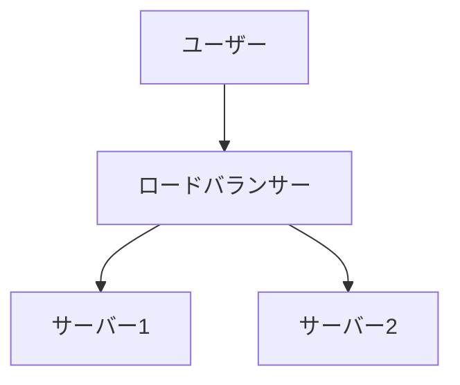

# Markdown Viewer

**Markdown で書いて、ワンクリックで完璧な Word にエクスポート。**

_完全無料 · ローカル処理 · 18+プロフェッショナルテーマ · 23 言語対応_

🚀 **今すぐインストール:** https://chromewebstore.google.com/detail/markdown-viewer/jekhhoflgcfoikceikgeenibinpojaoi

---

Markdown で書くのが好きですよね。クリーンで効率的で、バージョン管理に優しい。  
でも最終的には、いつも Word 文書が必要になります。

**以前の悪夢:**

😫 フローチャートを手動でスクリーンショット · 数式をコピーペーストすると乱れる · コードを手動でフォーマット · テーブルをセルごとに調整 · エクスポート後にフォント、間隔、色の調整に 30 分

**1 つの文書：1 時間の執筆、2 時間のフォーマット。**

---

**今では 1 秒で完了。**

ダウンロードをクリックして完璧な Word 文書を取得：

- ✅ Mermaid ダイアグラム → 高解像度画像
- ✅ LaTeX 数式 → Word 編集可能な数式
- ✅ 自動構文ハイライト（100+言語）
- ✅ ワンクリックで 18+プロフェッショナルテーマ
- ✅ 完全無料、ローカル処理

**執筆に時間を使い、フォーマットには使わない。**

---

## 💫 実際の動作を見る

### 技術文書：15 個のフローチャート、2 時間 → 5 分

**以前:** draw.io ダイアグラム → PNG 出力 → Word に挿入 → サイズ変更 → 15 回繰り返し = **2 時間**

**今:** Mermaid コード記述 → ダウンロードクリック = **5 分**

## システムアーキテクチャ

````markdown

````

変更が必要？コードを修正して再エクスポート。**115 分節約。**

### 学術論文：50+数式、3 時間 → 10 分

**以前:** Word 数式エディタで 1 つずつ OR 有料ツールのサブスクリプション = **3 時間 + 有料サブスクリプション**

**今:** LaTeX 構文を直接記述 → ダウンロードクリック = **10 分 + 無料**

質点の質量を $m$、加速度を $a$ とすると、ニュートンの第二法則により：

```markdown
$$
F = ma = m\frac{dv}{dt} = m\frac{d^2x}{dt^2}
$$
```

ネイティブ Word フォーマットでエクスポート、完全編集可能。**画像ではなく、本物の数式オブジェクト。**

### チームコラボレーション：週次レポート、1 時間 → 1 分

**以前:** コンテンツコピー → フォーマット設定 → リスト調整 → スタイル追加 → Excel チャート+スクリーンショット = **週 1 時間**

**今:** ファイルを開く → テーマ選択 → ダウンロードクリック = **1 分**

「Business」テーマを選択、Vega-Lite データチャートが自動的に高解像度画像に変換、プロフェッショナルな外観。**週 59 分節約。**

**ビジネスユースケース:**

- 📊 売上トレンド（折れ線グラフ）
- 📈 市場シェア比較（棒グラフ）
- 🎯 KPI 達成（ゲージ）
- 📉 コスト分析（積み上げグラフ）

データに語らせ、ワンクリックでプロフェッショナルなレポートを生成。

---

## 🎯 3 つのコア機能

### 1. 自動ダイアグラム変換

**Mermaid ダイアグラム** · **Vega/Vega-Lite データチャート** · SVG 画像 · 複雑な HTML テーブル

**Mermaid:** フローチャート、シーケンス図、クラス図、状態図 → 技術文書、アーキテクチャ設計  
**Vega/Vega-Lite:** 棒グラフ、折れ線グラフ、散布図、ヒートマップ → ビジネスレポート、データ分析

**時間比較:** 複雑なシーケンス図（10 オブジェクト）

- 従来のツール: 描画 30 分 + 修正 20 分 + 調整 10 分 + エクスポート 5 分 = **65 分**
- Markdown Viewer: コード記述 5 分 + 修正 30 秒 + エクスポート 1 秒 = **6 分**

**ビジネスシナリオ:** 四半期売上レポート（5 つの棒グラフ）

- Excel チャート+スクリーンショット: データ選択 15 分 + フォーマット 10 分 + スクリーンショット 5 分 = **30 分**
- Vega-Lite: JSON データ 2 分 + ワンクリックエクスポート = **3 分**

**正確、プロフェッショナル、再利用可能。**

### 2. 完璧な数式変換

LaTeX → Word 編集可能な数式（画像ではありません！）

エクスポート後、以下が可能：

- ✅ Word で編集を続ける
- ✅ フォントサイズを調整
- ✅ 記号と変数を修正
- ✅ 他の文書にコピー

**1 つの数式、2 つのアプローチ:**

- ❌ Word 数式エディタ: クリック...クリック...クリック...記号を選択...位置を調整
- ✅ LaTeX: `\int_0^\infty e^{-x^2}dx` 完了

### 3. 18+プロフェッショナルテーマ

異なるシナリオ、異なるスタイル、ワンクリック切り替え：

- 📊 Business / Technical → ビジネスレポート、技術文書
- 📚 Academic / Palatino → 学術論文、書籍組版
- 🇨🇳 Songti / Heiti / Mixed → 中国語文書
- 🎨 Typewriter / Sakura → クリエイティブコンテンツ

**WYSIWYG:** プレビューがエクスポートされた Word と完全に同じ。推測不要、試行不要。

**手動調整不要:** フォント、サイズ、行間、段落間隔、コード背景色...

---

## ⚡ 超高速体験

### スマートキャッシュ：初回 5 秒、2 回目 1 秒

50 個の Mermaid ダイアグラムを含む文書：

- **初回オープン:** テキストは即座に表示、ダイアグラムはバックグラウンドでレンダリング、5 秒以内に完了
- **2 回目オープン:** キャッシュから読み込み、即座に表示（<1 秒）
- **テキスト修正:** 依然として即座（ダイアグラムはキャッシュから）
- **ダイアグラム修正:** 変更されたダイアグラムのみ再レンダリング

\***\*Word より 10 倍速く、ファイルサイズは 100 倍小さい。**

### 読書機能強化

- **3 つのレイアウト:** 通常（1000px）/ フルスクリーン / 狭い（530px、Word プレビュー効果）
- **柔軟なズーム:** 50%-400%、ショートカット `Ctrl/Cmd +` `-` `0`
- **スマート目次:** 見出しを自動抽出、サイドバーナビゲーション、`Ctrl/Cmd + B` で切り替え
- **位置記憶:** スクロール位置を自動保存、次回続きから読める
- **履歴:** 最近開いたドキュメントを追跡

---

## 🚀 クイックスタート - 3 ステップ

### ステップ 1: 拡張機能をインストール（30 秒）

1. Chrome ブラウザを開く
2. Chrome Web Store にアクセス
3. "Markdown Viewer"を検索
4. 「Chrome に追加」をクリック
5. ✅ インストール完了

### ステップ 2: ファイルアクセスを許可（1 分）

**ローカル.md ファイルを開きたい場合:**

1. `chrome://extensions/`を開く
2. Markdown Viewer を見つける
3. 「ファイルの URL へのアクセスを許可する」を有効化
4. ✅ ローカル Markdown ファイルをダブルクリックで開けるようになりました

**不要な場合:**

- オンラインドキュメントのみ表示（GitHub、ブログなど）
- ブラウザの「ファイルを開く」機能を使用

### クイックスタート

**文書を開く:** .md ファイルをダブルクリック、またはブラウザにドラッグ · GitHub ドキュメントは自動レンダリング

**Word にエクスポート:** ダウンロードボタンをクリック または `Ctrl/Cmd + S` → 進行状況を確認 → 自動保存

**テーマを切り替え:** ツールバーをクリック → テーマを選択 → 即座に適用

**ビューを調整:** `+`/`-` ズーム · レイアウト切り替え · `Ctrl/Cmd + B` 目次

---

## 🎁 完全な機能

### 完全な Markdown 構文サポート

見出し · 段落 · 太字 · 斜体 · 取り消し線 · リスト · タスクリスト · 引用 · コードブロック（100+言語ハイライト）· テーブル · リンク · 画像 · Mermaid ダイアグラム · Vega/Vega-Lite チャート · LaTeX 数式 · HTML · GFM 拡張

### 18 テーマ

**ビジネス:** Default · Business · Technical  
**学術:** Academic  
**セリフ:** Palatino · Garamond · Cambria · Elegant  
**サンセリフ:** Verdana · Trebuchet · Century  
**中国語:** Songti · Heiti · Mixed  
**クリエイティブ:** Typewriter · Sakura · Water · Minimal

### 23 インターフェース言語

簡体字中国語 · 繁体字中国語 · English · Deutsch · Español · Français · Italiano · Nederlands · Português (BR) · Português (PT) · Polski · Русский · 日本語 · 한국어 · ไทย · Tiếng Việt · हिन्दी · Bahasa Indonesia · Dansk · Suomi · Norsk · Svenska · Türkçe

---

## 💎 競争優位性

|                     | 手動スクリーンショット |    CLI ツール    |   オンラインサービス    | デスクトップエディタ |    Markdown Viewer    |
| ------------------- | :--------------------: | :--------------: | :---------------------: | :------------------: | :-------------------: |
| **使いやすさ**      |          面倒          | セットアップ必要 |    アップロード必要     |   インストール必要   |    ✅ ワンクリック    |
| **Mermaid**         | 手動スクリーンショット |  プラグイン必要  |       ✅ サポート       |     ✅ サポート      | ✅ ネイティブサポート |
| **数学式**          |          画像          |       画像       |          画像           |         画像         |      ✅ 編集可能      |
| **プライバシー**    |      ✅ ローカル       |   ✅ ローカル    | ❌ クラウドアップロード |     ✅ ローカル      |      ✅ ローカル      |
| **テーマ**          |           -            |        -         |           3-5           |         5-10         |        ✅ 18+         |
| **オフライン**      |           ✅           |        ✅        |           ❌            |          ✅          |          ✅           |
| **GitHub 直接表示** |           ❌           |        ❌        |           ❌            |          ❌          |          ✅           |
| **価格**            |          無料          |       無料       |       有料プラン        |      有料プラン      |        ✅ 無料        |

**コアアドバンテージ：より速く、より安く、より安全、より強力。**

---

## ❓ よくある質問

**Q: エクスポートされた Word 文書は編集できますか？**  
A: はい。標準の.docx 形式で、数式は編集可能で、画像ではありません。

**Q: どのようなダイアグラムがサポートされていますか？**  
A: すべての Mermaid ダイアグラム（フローチャート、シーケンス、ガント、クラス、状態、円グラフ、ER など）、Vega/Vega-Lite データ可視化チャート + SVG 自動変換。

**Q: ファイルサイズに制限はありますか？**  
A: 制限なし。スマートキャッシュで、100+ダイアグラムの文書も瞬時に開きます。

**Q: インターネットが必要ですか？**  
A: いいえ。完全にローカル処理、オフラインで動作します。

**Q: 文書はアップロードされますか？**  
A: 絶対にありません。すべての処理はローカルで行われます。

**Q: テーマを変更するには？**  
A: ツールバーアイコンをクリック → テーマを選択 → 即座に適用。

**Q: テーマをカスタマイズできますか？**  
A: 現在 18 のプリセットテーマ、カスタマイズは計画中です。

**Q: 大きな文書は遅くなりますか？**  
A: いいえ。プログレッシブローディング + スマートキャッシュで、テキストは即座に表示、ダイアグラムはバックグラウンドでレンダリング（初回 5 秒、2 回目 1 秒）。

**Q: キャッシュは多くのスペースを使用しますか？**  
A: デフォルトで最大 1000 項目、約 500 MB、設定で調整または削除可能。

**Q: どのブラウザがサポートされていますか？**  
A: Chrome および Chromium ベースのブラウザ（Edge、Brave、Opera）。

**Q: エクスポートされたファイルはどの Word バージョンで開けますか？**  
A: Word 2016+完全サポート、Word 2013 も動作します。WPS Office と完全互換。

**Q: PDF にエクスポートできますか？**  
A: 現在 Word のみ、PDF 対応を計画中。まず Word にエクスポートしてから PDF として保存できます。

**Q: どのテーマが適していますか？**  
A: ビジネスレポート → Business · 学術論文 → Academic · 技術文書 → Technical · 中国語文書 → Songti/Mixed

**Q: Vega と Mermaid の違いは何ですか？**  
A: **Mermaid**はフローチャート、アーキテクチャ図などの図式的なダイアグラム用；**Vega/Vega-Lite**は売上チャート、財務レポートなどのデータ駆動型ビジネスチャートのためのデータ可視化用。異なるシナリオで補完し合います。

**Q: Vega-Lite でチャートを作成するには？**  
A: Markdown で````vega-lite`コードブロックを使用し、JSON 形式のチャート仕様を記述します。[Vega-Lite 公式例](https://vega.github.io/vega-lite/examples/)を参照。

---

## 🔒 プライバシーの約束

- ✅ すべての処理はローカルで完了、絶対にアップロードしません
- ✅ トラッキングなし、個人データ収集なし
- ✅ オープンソースコード、監査可能で透明
- ✅ Chrome Web Store セキュリティ承認済み（Manifest V3）

**あなたのプライバシーは 100%保護されています。**

---

## 🆘 ヘルプを得る

📖 [完全ドキュメント](https://github.com/xicilion/markdown-viewer-extension) · 🐛 [問題を報告](https://github.com/xicilion/markdown-viewer-extension/issues) · 💡 [機能リクエスト](https://github.com/xicilion/markdown-viewer-extension/issues) · ⭐ [GitHub Star](https://github.com/xicilion/markdown-viewer-extension)

---

## 🎉 今すぐ始める

**30 秒でインストール、すぐに使用開始:**

1. Chrome Web Store にアクセス → "Markdown Viewer"を検索
2. 「Chrome に追加」をクリック
3. 「拡張機能を管理」をクリック、「ファイルの URL へのアクセスを許可する」を有効化
4. `.md`ファイルをブラウザにドラッグ
5. ✅ 使用開始

**得られるもの:** Markdown → Word ワンクリック変換 · Mermaid 自動変換 · LaTeX 編集可能数式 · 100+言語構文ハイライト · 18+テーマ · スマートキャッシュ · 完全無料

**最適な対象:** 技術ライター · 学生/研究者 · プロダクトマネージャー · 開発者 · Markdown を使用するすべての人

---

## 📜 オープンソースライセンス

このプロジェクトは ISC ライセンスの下でオープンソースです。Star の歓迎、問題報告、機能提案、コード貢献。

**プロジェクト URL:** https://github.com/xicilion/markdown-viewer-extension

---

**フォーマットに時間を無駄にしないでください**

**執筆に集中し、他のすべては Markdown Viewer に任せてください**

🚀 **今すぐインストール:** https://chromewebstore.google.com/detail/markdown-viewer/jekhhoflgcfoikceikgeenibinpojaoi

_完全無料 · ローカル処理 · プライバシー保護_
